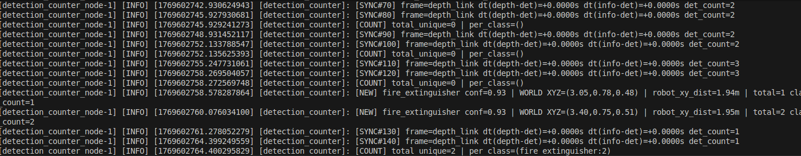

#  Hospital Robot - Emergency Equipment Detection & Counting

[](https://docs.ros.org/en/humble/)
[](http://gazebosim.org/)
[](https://www.python.org/)
[](https://github.com/ultralytics/ultralytics)

A ROS2 Humble autonomous navigation and object detection system for emergency equipment inventory in simulated hospital environments. The system uses YOLOv8 for real-time detection, Cartographer for SLAM mapping, Nav2 for autonomous navigation, and 3D point cloud projection for spatial deduplication and counting.


---

## Table of Contents

- [Hospital Robot - Emergency Equipment Detection \& Counting](#hospital-robot---emergency-equipment-detection--counting)
  - [Table of Contents](#table-of-contents)
  - [Overview](#overview)
  - [Features](#features)
  - [System Architecture](#system-architecture)
    - [Architecture Overview](#architecture-overview)
  - [Prerequisites](#prerequisites)
  - [Installation](#installation)
    - [1. Clone Repository](#1-clone-repository)
    - [2. Devcontainer Setup (Recommended)](#2-devcontainer-setup-recommended)
    - [3. Install Perception Dependencies](#3-install-perception-dependencies)
    - [4. Install Additional ROS2 Tools](#4-install-additional-ros2-tools)
    - [5. Build Workspace](#5-build-workspace)
  - [Package Structure](#package-structure)
    - [Package Overview](#package-overview)
    - [Detailed Structure](#detailed-structure)
  - [Quickstart](#quickstart)
  - [Detailed Usage](#detailed-usage)
    - [1. Simulation Environment](#1-simulation-environment)
    - [2. SLAM Mapping](#2-slam-mapping)
    - [3. Autonomous Navigation](#3-autonomous-navigation)
    - [4. Object Detection](#4-object-detection)
    - [5. Detection Counting](#5-detection-counting)
    - [6. Waypoint Mission](#6-waypoint-mission)
  - [Topics and Services](#topics-and-services)
    - [Key Topics](#key-topics)
    - [Inspection Commands](#inspection-commands)
  - [Key Parameters](#key-parameters)
    - [YOLOv8 Detection Node](#yolov8-detection-node)
    - [Detection Counter Node](#detection-counter-node)
    - [Nav2 Parameters](#nav2-parameters)
  - [Results](#results)
    - [Detection Performance](#detection-performance)
    - [Navigation Performance](#navigation-performance)
    - [Discussion](#discussion)
  - [Troubleshooting](#troubleshooting)
    - [Gazebo Not Starting or /clock Missing](#gazebo-not-starting-or-clock-missing)
    - [YOLOv8 OpenCV Incompatibility](#yolov8-opencv-incompatibility)
    - [PyTorch CUDA Errors](#pytorch-cuda-errors)
    - [NumPy Version Conflicts](#numpy-version-conflicts)
    - [Nav2 Crashes on Launch](#nav2-crashes-on-launch)
    - [TF Lookup Failures](#tf-lookup-failures)
    - [Detection Counter Not Publishing](#detection-counter-not-publishing)
    - [Map Saving Issues](#map-saving-issues)
    - [Additional Diagnostic Tools](#additional-diagnostic-tools)
  - [Credits](#credits)
  - [License](#license)

---

## Overview

This project implements an autonomous robot inspection system for hospital emergency equipment inventory using a LIMO robot platform in Gazebo Classic simulation. The pipeline integrates:

- **Custom Gazebo hospital world** with realistic emergency equipment placement
- **YOLOv8-based object detection** for fire extinguishers, first aid kits, and exit signs
- **Cartographer SLAM** for real-time mapping
- **Nav2 AMCL localization** for autonomous navigation
- **3D spatial deduplication** using depth camera projection and TF transforms
- **Waypoint-based autonomous missions** for full floor coverage

The system achieved **97.2% redundancy filtering** with **38/47 equipment items** correctly identified in online testing, processing at **53.7±11.2 FPS** with **19.4ms latency**.


*Custom hospital ground floor environment with emergency equipment*

---

## Features

- ✅ **Real-time YOLOv8 detection** (mAP@0.5: 0.959, precision: 0.891, recall: 0.950)
- ✅ **Multi-threaded detection pipeline** with queue-based processing
- ✅ **3D point cloud projection** using depth camera + camera intrinsics
- ✅ **TF-based world-frame transformation** for spatial deduplication
- ✅ **Distance-gated counting** (proximity filtering relative to robot)
- ✅ **ApproximateTimeSynchronizer** for sensor fusion (RGB + Depth + CameraInfo)
- ✅ **Nav2 waypoint following** with automatic recovery behaviors
- ✅ **Devcontainer-based development** with GPU passthrough and VNC desktop
- ✅ **Custom ROS2 messages** for detection arrays and statistics

---

## System Architecture


*Complete perception and navigation pipeline*

### Architecture Overview

**Data Flow:**
1. **Gazebo Simulation** → publishes RGB images (`/limo/depth_camera_link/image_raw`), depth images, and camera intrinsics
2. **YOLOv8 Node** → processes RGB stream, publishes bounding boxes (`/hospital/detections`) and annotated images
3. **Detection Counter Node** → synchronizes detections + depth + intrinsics, projects 2D→3D, transforms to map frame, deduplicates, maintains inventory
4. **Nav2 Stack** → handles localization (AMCL) and path planning using Cartographer-generated maps
5. **Waypoint Follower** → autonomously navigates inspection routes using `nav2_simple_commander`

**Key TF Frames:**
- `map` → global reference frame
- `odom` → odometry frame (drift-prone)
- `base_link` → robot base
- `depth_camera_link` → camera optical frame

**Why Depth + CameraInfo?**
- Depth image provides per-pixel range measurements
- CameraInfo contains pinhole model intrinsics (fx, fy, cx, cy)
- Combined, they enable accurate 3D reconstruction: `X = (u - cx) * Z / fx`, `Y = (v - cy) * Z / fy`

**Why ApproximateTimeSynchronizer?**
- RGB, depth, and CameraInfo published at different rates with clock jitter
- `slop=0.1` allows ±100ms tolerance for message alignment
- Ensures spatially/temporally consistent sensor fusion

**Deduplication Logic:**
- Projects bbox center to 3D world coordinates using TF (`depth_camera_link` → `map`)
- Maintains per-class inventory with XY threshold (0.5m) and Z threshold (0.3m)
- Filters duplicates seen from different viewpoints/timestamps
- Distance-gates detections by robot proximity to avoid distant false positives


*YOLOv8 detection samples on fire extinguishers, first aid kits, and exit signs*

---

## Prerequisites

- **OS:** Ubuntu 22.04 (native or WSL2/Windows with Docker Desktop)
- **ROS2:** Humble Hawksbill
- **Docker:** 20.10+ with GPU support (`nvidia-docker2` or `--gpus=all`)
- **NVIDIA GPU:** CUDA 12.1 compatible (optional but recommended)
- **VS Code:** With Dev Containers extension (for devcontainer workflow)


---

## Installation

### 1. Clone Repository

```bash
git clone https://github.com/yourusername/hospital_robot_project.git
cd hospital_robot_project
```

### 2. Devcontainer Setup (Recommended)

Open in VS Code and select **"Reopen in Container"**. The `.devcontainer/devcontainer.json` configures:
- Base image: `lcas.lincoln.ac.uk/lcas/cmp9767:1.0`
- GPU passthrough: `--gpus=all`
- Network: `--net=host`
- X11 forwarding for GUI (VNC desktop accessible via browser)
- Auto-sourcing of ROS2 + workspace

**Post-create script** (`post-create.sh`) handles:
```bash
source /opt/ros/humble/setup.bash
source /opt/limo_ros2/install/setup.bash
colcon build --symlink-install
source install/setup.bash
```

### 3. Install Perception Dependencies

Inside the container:

```bash
# Remove conflicting local packages
rm -rf ~/.local/lib/python3.10/site-packages/{torch,torchvision,ultralytics,numpy,cv2,opencv}

# Install pinned versions
pip install --break-system-packages \
  numpy==1.24.3 \
  opencv-python==4.8.1.78 \
  ultralytics==8.0.200 \
  flask \
  Pillow

# Install PyTorch with CUDA 12.1 (or CPU if no GPU)
pip install --break-system-packages \
  torch==2.4.1 torchvision==0.19.1 torchaudio==2.4.1 \
  --index-url https://download.pytorch.org/whl/cu121

# For CPU-only (alternative):
# --index-url https://download.pytorch.org/whl/cpu
```

### 4. Install Additional ROS2 Tools

```bash
sudo apt update
sudo apt install -y \
  ros-humble-rqt-tf-tree \
  ros-humble-rqt-image-view \
  ros-humble-rqt-reconfigure
pip install --break-system-packages nav2-simple-commander
```

### 5. Build Workspace

```bash
cd ~/hospital_robot_project
colcon build --symlink-install
source install/setup.bash
```

---

## Package Structure

### Package Overview

| Package | Description |
|---------|-------------|
| `hospital_simulation` | Gazebo world, LIMO spawn, twist watchdog, model paths |
| `hospital_sim_navigation` | Cartographer SLAM, Nav2 AMCL, maps, RViz configs |
| `hospital_sim_perception` | YOLOv8 detection, 3D counting, waypoint follower, sync checker |
| `hospital_sim_msgs` | Custom messages: `Detection`, `DetectionArray`, `DetectionStats` |

### Detailed Structure

```
hospital_robot_project/
├── src
    ├── hospital_simulation/
    │   ├── launch/
    │   │   └── hospital_world.launch.py        # Spawns Gazebo + LIMO
    │   ├── worlds/
    │   │   └── hospital_ground_floor_complete.world
    │   ├── components/                         # Custom Gazebo models
    │   └── config/
    ├── hospital_sim_navigation/
    │   ├── launch/
    │   │   ├── hospital_cartographer.launch.py # SLAM mapping
    │   │   └── hospital_nav.launch.py          # Nav2 localization
    │   ├── maps/
    │   │   ├── hospital_map_first.pgm          # Saved map image
    │   │   └── hospital_map_first.yaml         # Map metadata
    │   ├── config/
    │   │   ├── nav2_params.yaml                # Tuned navigation parameters
    │   │   └── cartographer_config.lua
    │   └── rviz/
    ├── hospital_sim_perception/
    │   ├── launch/
    │   │   ├── yolo_detection.launch.py        # YOLOv8 node
    │   │   └── detector.launch.py              # Counter + optional YOLO
    │   ├── hospital_sim_perception/
    │   │   ├── yolo_node.py                    # Multi-threaded detector
    │   │   ├── detection_counter_node.py       # 3D deduplication
    │   │   ├── waypoint_follower.py            # Mission executor
    │   │   └── topic_check.py                  # Sync validator
    │   ├── scripts/
    │   │   └── yolo_test_withoutROS.py         # Standalone debug
    │   └── models/
    │       └── best.pt                         # Trained YOLOv8 weights
    └── hospital_sim_msgs/
        └── msg/
            ├── Detection.msg                   # Single detection
            ├── DetectionArray.msg              # Batch detections
            └── DetectionStats.msg              # Counter statistics
```

---

## Quickstart

**Full pipeline in 4 terminals:**

```bash
# Terminal 1: Launch Gazebo + LIMO
ros2 launch hospital_simulation hospital_world.launch.py

# Terminal 2: Start Navigation (ensure Gazebo fully loaded first!)
ros2 launch hospital_sim_navigation hospital_nav.launch.py

# Terminal 3: Run YOLO Detection
ros2 launch hospital_sim_perception yolo_detection.launch.py

# Terminal 4: Run Detection Counter
ros2 launch hospital_sim_perception detector.launch.py enable_yolo:=false
```

**Verify topics:**
```bash
ros2 topic list | grep hospital
ros2 topic echo /hospital/detections
```

---

## Detailed Usage

### 1. Simulation Environment

**Start Gazebo with hospital world:**
```bash
ros2 launch hospital_simulation hospital_world.launch.py
```

**What it does:**
- Loads `hospital_ground_floor_complete.world`
- Spawns LIMO robot at origin
- Sets `GAZEBO_MODEL_PATH` to include custom components
- Starts `twist_watchdog` for safety timeout

**Verify:**
```bash
gz model --model-name=limo --info  # Check LIMO spawn
ros2 topic hz /limo/depth_camera_link/image_raw  # ~30Hz expected
```

### 2. SLAM Mapping

**Generate map using Cartographer:**
```bash
ros2 launch hospital_sim_navigation hospital_cartographer.launch.py
```

**Manual teleoperation during mapping:**
```bash
# New terminal
ros2 run teleop_twist_keyboard teleop_twist_keyboard --ros-args -r /cmd_vel:=/limo/cmd_vel
```

**Save map after exploration:**
```bash
cd ~/hospital_robot_project/src/hospital_sim_navigation/maps/
ros2 run nav2_map_server map_saver_cli -f hospital_map_first
```

Generates `hospital_map_first.pgm` (occupancy grid) and `hospital_map_first.yaml` (metadata).


*YOLOv8 detection logs showing inference time and FPS*

### 3. Autonomous Navigation

**Launch Nav2 with AMCL localization:**
```bash
# Ensure Gazebo running first (/clock must be published)
ros2 launch hospital_sim_navigation hospital_nav.launch.py
```

**Set initial pose in RViz:**
1. Click "2D Pose Estimate"
2. Click and drag to set robot position/orientation
3. Verify particle cloud converges

**Send navigation goal:**
1. Click "Nav2 Goal"
2. Click target location
3. Monitor `/limo/cmd_vel` for movement

**Programmatic goal (example):**
```python
from nav2_simple_commander import BasicNavigator
nav = BasicNavigator()
nav.goToPose(pose)
```

### 4. Object Detection

**Run YOLOv8 detection node:**
```bash
ros2 launch hospital_sim_perception yolo_detection.launch.py
```

**Published topics:**
- `/hospital/detections` → `DetectionArray` with bboxes, classes, confidences
- `/hospital/detections/image` → Annotated RGB image

**View detections:**
```bash
# Annotated image
rqt_image_view /hospital/detections/image

# Detection data
ros2 topic echo /hospital/detections
```

**Performance metrics:**
- **Throughput:** 53.7±11.2 FPS
- **Latency:** 19.4ms per frame

### 5. Detection Counting

**Run 3D counter with deduplication:**
```bash
ros2 launch hospital_sim_perception detector.launch.py enable_yolo:=false
```

*Set `enable_yolo:=true` to launch YOLO + counter together.*

**What it does:**
1. Subscribes to `/hospital/detections`, `/limo/depth_camera_link/depth/image_raw`, `/limo/depth_camera_link/camera_info`
2. Synchronizes messages using `ApproximateTimeSynchronizer` (slop=0.1s)
3. For each detection bbox center (u,v):
   - Samples 5×5 depth grid, computes median Z
   - Projects to 3D camera frame: `(X, Y, Z) = ((u-cx)*Z/fx, (v-cy)*Z/fy, Z)`
   - Transforms to `map` frame using TF
   - Distance-gates by robot proximity
   - Deduplicates using XY threshold (0.5m) + Z threshold (0.3m)
4. Publishes `/hospital/detection_stats`


*Detection counter logs showing synchronization, 3D coordinates, and deduplication*

**Check statistics:**
```bash
ros2 topic echo /hospital/detection_stats
```

### 6. Waypoint Mission

**Autonomous inspection route:**
```bash
ros2 run hospital_sim_perception waypoint_follower
```

Executes predefined waypoints using `nav2_simple_commander.followWaypoints()`. Update waypoint list in `waypoint_follower.py` for custom routes.

---

## Topics and Services

### Key Topics

| Topic | Type | Description |
|-------|------|-------------|
| `/limo/depth_camera_link/image_raw` | `sensor_msgs/Image` | RGB camera feed (640×480, 30Hz) |
| `/limo/depth_camera_link/depth/image_raw` | `sensor_msgs/Image` | Depth image (mm encoding) |
| `/limo/depth_camera_link/camera_info` | `sensor_msgs/CameraInfo` | Pinhole model intrinsics |
| `/hospital/detections` | `hospital_sim_msgs/DetectionArray` | YOLO detection bboxes |
| `/hospital/detections/image` | `sensor_msgs/Image` | Annotated RGB with bboxes |
| `/hospital/detection_stats` | `hospital_sim_msgs/DetectionStats` | Per-class inventory counts |
| `/limo/cmd_vel` | `geometry_msgs/Twist` | Robot velocity commands |
| `/map` | `nav_msgs/OccupancyGrid` | SLAM-generated map |
| `/tf` | `tf2_msgs/TFMessage` | Transform tree |

### Inspection Commands

```bash
# Check TF tree
ros2 run rqt_tf_tree rqt_tf_tree

# Echo specific transform
ros2 run tf2_ros tf2_echo map base_link

# Record data
ros2 bag record /hospital/detections /limo/depth_camera_link/image_raw

# Playback
ros2 bag play <bag_file>
```

---

## Key Parameters

### YOLOv8 Detection Node

```python
# In yolo_node.py
self.model_path = 'models/best.pt'       # Trained weights
self.confidence_threshold = 0.5          # Detection confidence
self.max_queue_size = 10                 # Processing queue
self.num_worker_threads = 2              # Parallel inference
```

### Detection Counter Node

```python
# In detection_counter_node.py
self.slop = 0.1                          # Sync tolerance (seconds)
self.xy_threshold = 0.5                  # Dedup XY distance (meters)
self.z_threshold = 0.3                   # Dedup Z distance (meters)
self.max_detection_distance = 5.0        # Max counting range (meters)
self.depth_sample_size = 5               # Median filter grid size
```

### Nav2 Parameters

Located in `hospital_sim_navigation/config/nav2_params.yaml`:

```yaml
controller_server:
  FollowPath:
    max_vel_x: 0.3                       # Max linear velocity
    max_vel_theta: 0.8                   # Max angular velocity
    
planner_server:
  GridBased:
    tolerance: 0.5                       # Goal tolerance (meters)
    
recovery_server:
  recovery_plugins: ["spin", "backup"]   # Recovery behaviors
```

---

## Results

### Detection Performance

| Metric | Value |
|--------|-------|
| mAP@0.5 | 0.959 |
| Precision | 0.891 |
| Recall | 0.950 |

### Navigation Performance

| Metric | Value |
|--------|-------|
| Mission Success Rate | 3/5 (60%) |
| Average Completion Time | ~29 minutes |
| Recovery Events | 12 |
| Collisions | 2 |


*Note: Expected counts based on final world snapshot (extinguishers: 21, first aid: 15, exits: 5).*

**System Efficiency:**
- **Redundancy Filtering:** 97.2% (duplicate detections successfully suppressed)
- **Throughput:** 53.7±11.2 FPS
- **Latency:** 19.4ms per detection cycle

### Discussion

The high mAP (0.959) demonstrates robust object detection under varied lighting and occlusion. The 92.7% counting accuracy with 97.2% deduplication proves the effectiveness of depth-based 3D projection and spatial filtering. Navigation challenges (60% success) stemmed from dynamic recovery behaviors and narrow corridor traversal—areas for future tuning of DWB parameters and inflation radii.

---

## Troubleshooting

### Gazebo Not Starting or /clock Missing

**Symptoms:** Nav2 fails with "Waiting for /clock", RViz shows stale transforms

**Solution:**
```bash
# Kill all Gazebo processes
killall -9 gzserver gzclient

# Restart simulation FIRST, then navigation
ros2 launch hospital_simulation hospital_world.launch.py
# Wait 10 seconds for full startup
ros2 launch hospital_sim_navigation hospital_nav.launch.py
```

### YOLOv8 OpenCV Incompatibility

**Symptoms:** `TypeError: 'NoneType' object is not subscriptable` in `ultralytics/utils/plotting.py`

**Solution:**
```bash
# Remove conflicting packages
rm -rf ~/.local/lib/python3.10/site-packages/{cv2,opencv,opencv_python}

# Reinstall pinned version
pip install --break-system-packages opencv-python==4.8.1.78

# Verify with standalone test
python3 scripts/yolo_test_withoutROS.py
```

### PyTorch CUDA Errors

**Symptoms:** `RuntimeError: CUDA error: no kernel image is available for execution`

**Solution:**
```bash
# Reinstall PyTorch with correct CUDA version
pip uninstall torch torchvision torchaudio
pip install --break-system-packages \
  torch==2.4.1 torchvision==0.19.1 torchaudio==2.4.1 \
  --index-url https://download.pytorch.org/whl/cu121

# Set library path for cuDNN
export LD_LIBRARY_PATH=/usr/local/cuda/lib64:$LD_LIBRARY_PATH
```

### NumPy Version Conflicts

**Symptoms:** `AttributeError: module 'numpy' has no attribute 'X'`

**Solution:**
```bash
pip install --break-system-packages "numpy<2.0" numpy==1.24.3
```

### Nav2 Crashes on Launch

**Symptoms:** `RewrittenYaml` AttributeError during `hospital_nav.launch.py`

**Cause:** Parameter file path issue in launch file

**Solution:** Verify `nav2_params.yaml` path in launch file:
```python
params_file = os.path.join(get_package_share_directory('hospital_sim_navigation'), 'config', 'nav2_params.yaml')
# Pass as string, not RewrittenYaml object
```

### TF Lookup Failures

**Symptoms:** `LookupException: map to depth_camera_link`

**Solution:**
```bash
# Check TF tree
ros2 run rqt_tf_tree rqt_tf_tree

# Verify frames exist
ros2 run tf2_ros tf2_echo map base_link

# Ensure Gazebo running (publishes base transforms)
ros2 topic hz /tf
```

### Detection Counter Not Publishing

**Symptoms:** No output on `/hospital/detection_stats`

**Solution:**
```bash
# Verify topic synchronization
ros2 run hospital_sim_perception topic_check

# Check message timing
ros2 topic hz /hospital/detections
ros2 topic hz /limo/depth_camera_link/depth/image_raw

# Increase slop tolerance if needed (in detector_node.py)
self.slop = 0.2  # Increase from 0.1
```

### Map Saving Issues

**Correct workflow:**
```bash
# Navigate to maps directory FIRST
cd ~/hospital_robot_project/src/hospital_sim_navigation/maps/

# Then save map
ros2 run nav2_map_server map_saver_cli -f hospital_map_first

# Verify files created
ls -lh hospital_map_first.*
```

### Additional Diagnostic Tools

```bash
# Dynamic parameter reconfiguration
ros2 run rqt_reconfigure rqt_reconfigure

# Image visualization
rqt_image_view

# Node graph
rqt_graph

# Topic monitoring
ros2 topic list -v
ros2 topic info /hospital/detections --verbose
```

---

## Credits

- **L-CAS Team** ([Lincoln Centre for Autonomous Systems](https://lcas.lincoln.ac.uk/)) - Base Docker image and ROS2 environment
- **LIMO Robot Packages** - AgileX LIMO simulation and control stack
- **Ultralytics** - YOLOv8 object detection framework
- **Open Robotics** - ROS2, Nav2, Gazebo Classic
- **Cartographer Team** - Google Cartographer SLAM

---

## License

This project is developed for academic purposes as part of CMP9767 Robot Programming coursework. 

**Third-party components:**
- ROS2 packages: Apache 2.0
- YOLOv8: AGPL-3.0
- LIMO simulation: BSD-3-Clause

For commercial use, please review individual component licenses.

---

**Repository Structure:**
```
 hospital_robot_project/
├── hospital_simulation          # Gazebo world
├── hospital_sim_navigation     # SLAM + Nav2
├── hospital_sim_perception     # YOLO + counting
├── hospital_sim_msgs            # Custom messages
└── .devcontainer                # Dev environment
```

**Quick Commands Reference:**
```bash
# Start everything
ros2 launch hospital_simulation hospital_world.launch.py
ros2 launch hospital_sim_navigation hospital_nav.launch.py
ros2 launch hospital_sim_perception yolo_detection.launch.py
ros2 launch hospital_sim_perception detector.launch.py

# Monitor
ros2 topic echo /hospital/detection_stats
rqt_image_view /hospital/detections/image
```

---

For issues or questions, please open a GitHub issue or contact the maintainer.
